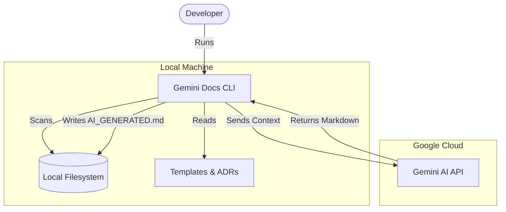

# Gemini Docs CLI

## 🏗️ Architecture (C4 Model)

The Gemini Docs CLI is a local orchestration tool that aggregates source code, design records, and templates to generate documentation via Google's Gemini AI.

## 🔌 Integrations & Data Flow

| Direction | System/Service | Protocol | Purpose | Auth Method |
|--|--|--|--|--|
| **Downstream** | Google Gemini API | HTTPS/gRPC | LLM Content Generation | API Key (Env) |
| **Internal** | Local Filesystem | File I/O | Reads source code and templates | OS Permissions |
| **Internal** | gitignore | Logic | Filters files based on .gitignore | N/A |

## ⚙️ Key Configuration & Behavior

| Environment Variable / Flag | Description | Criticality |
|--|--|--|
| `GEMINI_API_KEY` | API key for Google AI SDK authentication | High |
| `-model` | Specific Gemini model (e.g., gemini-3-flash-preview) | Medium |
| `-path` | Target directory for scanning and output | High |
| `docs/templates/` | System instructions and formatting templates | High |

## 🔒 Security Posture
- **Authentication**: Uses `GEMINI_API_KEY` environment variable. The client initialization suggests standard SDK credential discovery.
- **Authorization**: N/A (Local execution).
- **Data Privacy**: **High Risk.** The application sends the entire source code and Architecture Decision Records (ADRs) to Google’s servers. Avoid use with sensitive/proprietary code unless data processing agreements are in place.

## 💰 FinOps Notes
- **Token Costs**: Gemini models charge per 1k tokens. Scanning large codebases or passing massive context (vendor/node_modules) can lead to significant API costs. 
- **Efficiency**: The tool implements a `.gitignore` parser and directory exclusion (e.g., `vendor`, `.git`) to minimize unnecessary token consumption.